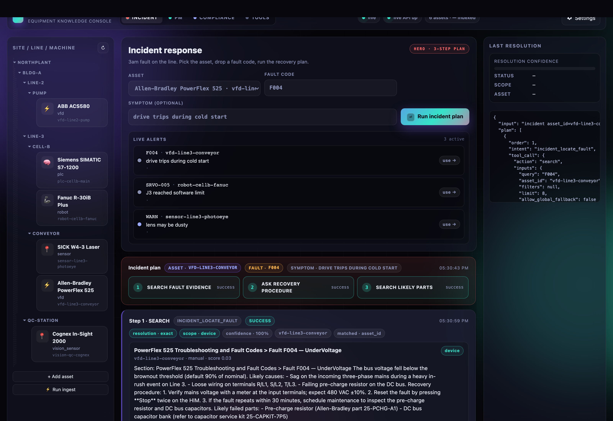
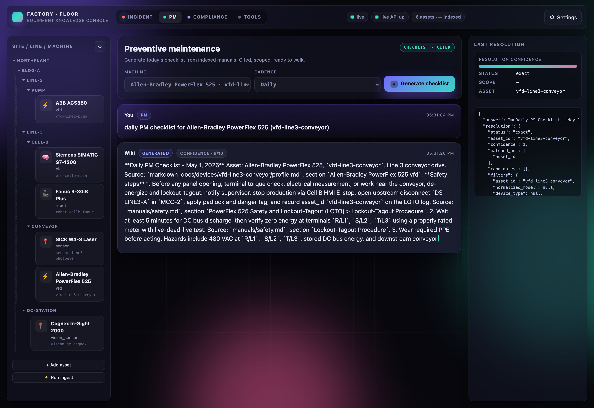
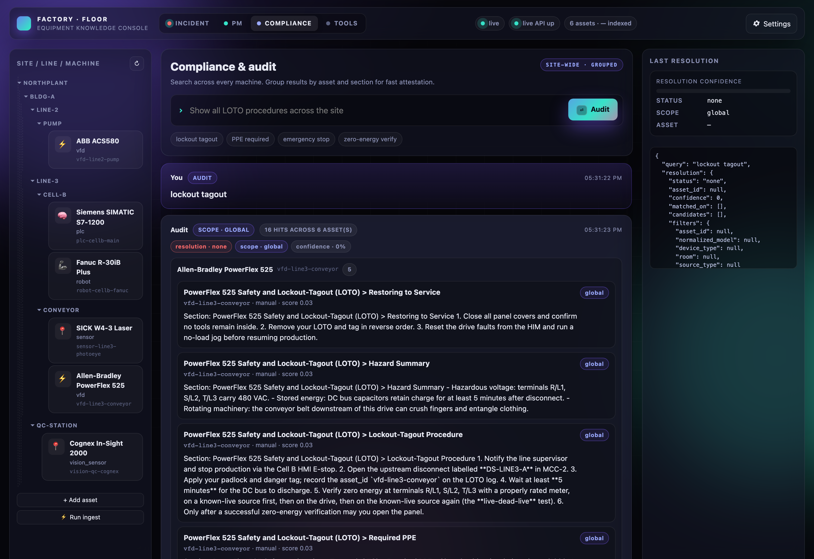

# Factory Floor Console

A retrieval-augmented troubleshooting console for industrial equipment. Point it at a folder of equipment manuals and it indexes them with a hybrid LanceDB store, then answers fault-code questions, generates preventive-maintenance checklists, and runs site-wide compliance audits — every answer cited back to the source section.

This repo started as a home-appliance knowledge base (see commit history). It now ships a factory-floor demo that proves the same agentic stack scales from a dishwasher to a 1,400-page VFD manual without changing any schemas.

## Why

A fault code at 3am on a production line costs real money per minute of downtime. The on-call tech doesn't have time to flip through a 1,400-page PDF — they need the relevant section, the recovery procedure, and the likely failed parts in one shot, with the source so they can verify before turning a wrench.

That's the bang-for-token bet: high-cost downtime + dense reference manuals = a place where retrieval + a small agent plan earns its keep.

## Three demo flows

### 1. Incident response (hero)

Pick the asset, drop a fault code, hit run. The agent emits a 3-step plan and streams each step into the timeline as it completes:

1. **SEARCH** — locate the fault-code section in the manual (cited, scoped to the asset).
2. **ASK** — generate a recovery procedure grounded in that evidence, with safety steps (LOTO, PPE, de-energize) and confidence.
3. **SEARCH** — pull likely failed parts and replacement part numbers from the same manual.

Live alerts on the right side of the hero are wired to a fixture file — clicking one auto-fills the form. Swap the fixture for a real telemetry feed and the demo is a thin wrapper over the same plan.



### 2. Preventive maintenance

Pick a machine and a cadence (daily / weekly / quarterly). The console asks the wiki for today's checklist, scoped to that asset, and renders a cited list of inspection points, lubrication points, fastener torque checks, and safety steps. Walk it on the floor.



### 3. Compliance & audit

Search across every machine on the site (`lockout tagout`, `PPE required`, `emergency stop`, `zero-energy verification`). Results are grouped by asset so an auditor can attest section-by-section across the whole line in one pass.



## Architecture

The factory pivot is **additive**. Every backend module from the original home-wiki is reused unchanged:

- **`homewiki/lancedb_store.py`** — hybrid (vector + BM25) store over equipment manuals.
- **`homewiki/ingest.py` / `conversion.py` / `chunking.py`** — Markdown conversion + section-aware chunking. PDFs get converted via [docling](https://github.com/docling-project/docling).
- **`homewiki/search_service.py`** — resolution-aware search (asset-scoped vs global, exact / ambiguous / none).
- **`homewiki/ask_service.py`** — Ask = search + optional chat completion, with evidence-only fallback when the chat provider is disabled.
- **`homewiki/agent.py`** — small deterministic plan executor that dispatches tool calls (SEARCH / ASK) and aggregates results.
- **`homewiki/devices.py` / `resolver.py`** — entity-neutral device registry; `device_type="VFD"` and `room="NorthPlant/Bldg-A/Line-3"` work without schema changes.

What was added for the pivot:

- **`HOME_WIKI_DOMAIN_MODE=industrial`** flag in `homewiki/config.py` selects an industrial system prompt (LOTO / PPE / fault-code language) without touching the home prompt.
- **`POST /agent/incident`** endpoint backed by `build_incident_plan(asset_id, fault_code, symptom)` which emits the 3-step plan above.
- **`seeds/factory/`** — 6 real industrial assets (Allen-Bradley PowerFlex 525, ABB ACS580, Siemens S7-1200, Fanuc R-30iB, SICK W4, Cognex In-Sight 2000) with fixture manuals laid out as Site → Building → Line → Cell.
- **`ui-next/`** — three new hero tabs (Incident / PM / Compliance), Site/Line/Machine sidebar, animated agent timeline, live-alerts fixture panel. The legacy Devices/Search/Ask/Manuals tabs are preserved under "Tools".

## Quickstart

```bash
# Install
python -m venv .venv && source .venv/bin/activate
pip install -e .

# Seed: copy fixture manuals + ingest them into a local LanceDB
HOME_WIKI_DOMAIN_MODE=industrial \
HOME_WIKI_SOURCE_DOCS=.demo/source_docs \
HOME_WIKI_MARKDOWN_DOCS=.demo/markdown_docs \
HOME_WIKI_LANCEDB_DIR=.demo/lancedb \
HOME_WIKI_DEVICE_REGISTRY=.demo/devices.sqlite \
HOME_WIKI_INGEST_MANIFEST=.demo/ingest_manifest.sqlite \
python seeds/factory/load.py

# Run the API on port 8124
HOME_WIKI_DOMAIN_MODE=industrial \
HOME_WIKI_SOURCE_DOCS=.demo/source_docs \
HOME_WIKI_MARKDOWN_DOCS=.demo/markdown_docs \
HOME_WIKI_LANCEDB_DIR=.demo/lancedb \
HOME_WIKI_DEVICE_REGISTRY=.demo/devices.sqlite \
HOME_WIKI_INGEST_MANIFEST=.demo/ingest_manifest.sqlite \
CHAT_PROVIDER=codex_cli CODEX_CMD=$(which codex) \
python -m uvicorn homewiki.api:app --port 8124

# Run the UI on port 5274
UI_PORT=5274 UI_API_BASE=http://127.0.0.1:8124 python ui-next/server.py

# Open http://localhost:5274/ui-next/
```

Switch `CHAT_PROVIDER` to `lmstudio_openai`, `openai_compatible`, or `disabled` (evidence-only fallback) depending on what's available locally. See `homewiki/config.py` for the full list of env vars.

## Notes

- **Reproducible**: the seed loader uses fixture manuals checked into `seeds/factory/manuals/`. No live web fetches required to run the demo.
- **Backwards-compatible**: with `HOME_WIKI_DOMAIN_MODE=home` (the default), the original home-appliance demo and tests still pass. The industrial prompt only activates when the flag is set.
- **Ports**: the demo runs on API `8124` / UI `5274` so it can coexist with the original home-wiki on `8000`/`5273`.
